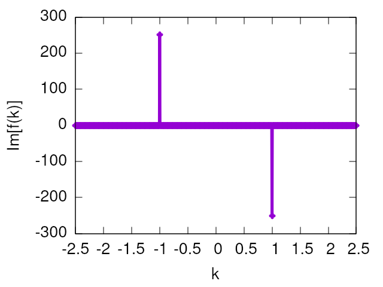

# Fast Fourier Transform (FFT)

We'll use the **FFTW (version 3)** library (fastest Fourier transform in the west), which natively uses openMP for multi-thread calculations.

**Installing**

On Debian/Ubuntu, install the following packages:

```bash
$ sudo apt update
$ sudo apt install libfftw3-dev
```

On Manjaro/Arch, install:

```bash
$ sudo pacman -Syy
$ sudo pacman -S fftw
```

**The header file**

It's sufficient to `#include <fftw3.h>`.

**Compile and link the library**

To compile, call the linker with `-lfftw3`.

```bash
$ gcc mycode.c -lfftw3
```

## References

The list below points to references for the FFTW code documentation and tutorials. But now it is also important to check the mathematical properties of the Fourier transform. For this purpose, the [Wikipedia - Fourier transform](https://en.wikipedia.org/wiki/Fourier_transform) has a complete description. Check, for instance, the table in the section **"Functional relationships, one-dimensional"** and the full section on **"Properties of the Fourier transform"**.

- The [official webpage](http://www.fftw.org)
- The [documentation](http://www.fftw.org/fftw3_doc/) also includes a tutorial
- [My old class notes on FFT](https://gitlab.com/gersonjferreira/intro-comp-phys/-/blob/master/ClassNotes/Aula%2009%20-%20FFT.pdf)

## Main Fourier transform properties

As an exercise, you should try to verify all these properties with your code. The numbers indicate the lines in the table at [Wikipedia - Fourier transform](https://en.wikipedia.org/wiki/Fourier_transform).

1. Translation and modulation (102 and 103)
2. Scaling (104)
3. Differentiation (106 and 107)
4. Convolution (108 and 109)
5. ...

## Important cases

Use your code to check these Fourier transforms:

1. Trigonometric functions: sin, cos, tan
2. Gaussian: compare thin and wide gaussians (quantum uncertainty relation)
3. Complex exponential
4. Dirac-delta distribution
5. ...

# The numerical Fourier transform

There are many different notations for the Fourier transform differing by the norm or by phase factor. So, it is important to keep in mind what is actually implemented on the FFT codes. They are all efficient implementations of the discrete Fourier transform (DFT).

Let's start with the mathematical definition of the Fourier transform we want to use and compare to what is actually implemented on the FFTW library. It is important to understand these differences before trying to use it.

#### Fourier series or Fourier transform?

Consider that our function *f(x)* is periodic, and has a period *L* within a domain *[-L/2,L/2)*. Notice that right end of the domain is open, since the periodicity implies *f(L/2) = f(-L/2)*. Any periodic function like this one can be written as a Fourier series expansion as

```math
f(x) = \dfrac{\sqrt{2\pi}}{L}\sum_n c_n e^{+i k_n x}
```

with *n = 0, ±1, ±2, ±3, ...*, and the periodicity *f(L/2) = f(-L/2)* requires $`k_n = 2\pi n/L`$. The prefactor $`\sqrt{2\pi}/L`$ is chosen to naturally obtain the Fourier transform below in the most interesting form.

To obtain the coefficient *c<sub>n</sub>* we multiply *f(x)* by *exp(-ik<sub>j</sub>x)* and integrate over *x* to use the plane-wave orthogonality and obtain

```math
c_n = \dfrac{1}{\sqrt{2\pi}} \int_{-L/2}^{L/2} f(x) e^{-i k_n x} dx
```

The Fourier series becomes the Fourier transform as we take $`L \rightarrow \infty`$ and $`k_n \rightarrow k`$ becomes continuous. In this case it is clear that *c<sub>n</sub>* becomes **the Fourier transform of *f(x)***

```math
c_n \rightarrow \tilde{f}(k) = \dfrac{1}{\sqrt{2\pi}} \int_{-\infty}^{\infty} f(x) e^{-i k x} dx
```

Consequently, the sum over *n* above becomes an integral. Notice that $`\Delta k = 2\pi/L \rightarrow dk`$ and the sum becomes an integral yielding **the inverse Fourier transform**

```math
\sum_n \rightarrow \dfrac{L}{2\pi} \int dk
\\
f(x) = \dfrac{1}{\sqrt{2\pi}} \int_{-\infty}^{\infty} \tilde{f}(k) e^{+i k x} dk
```

#### The discrete Fourier transform

We started with the Fourier series and took the limit of $`L\rightarrow \infty`$ to get the Fourier transform. Now let's go back to the series with a finite *L*... This is because we want to apply the Fourier transform on a limited numerical data that is restricted to a range *[a,b)*, with *b-a = L*, which is **assumed** to be periodic.

So, let's say that our *f(x)* is restricted to this domain *[a,b)*, and *x* is actually **discrete**, thus

```math
x \rightarrow x_j = a + j \Delta x
\\
\Delta x = L/N
\\
f(x) \rightarrow f(x_j) \rightarrow f_j
\\
j = 0, 1, \dots, N-1
```

Notice that $`x_N = a + L = b`$, thus $`f(x_0) = f(x_N)`$. Be careful here, since $`x_N = b`$ is actually not in the domain *[a,b)*. 

Let's define **OUR discrete Fourier transform (DFT)** similarly to the Fourier series above as

```math
f_j = \dfrac{\sqrt{2\pi}}{L}\sum_n \tilde{f}_n e^{+i k_n x_j}
\\
\tilde{f}_n = \dfrac{L/N}{\sqrt{2\pi}} \sum_j f_j e^{-i k_n x_j} 
```

with the discrete $`k_n = k_0 + \frac{2\pi}{L}n`$, for *n=0...(N-1)*. Thus, the domain on k-space depends on our choice of $`k_0`$, and the typical choices are

```math
k_0 = 0 \rightarrow k = [0, \frac{2\pi}{\Delta x})
\\
k_0 = -\frac{\pi}{\Delta x} \rightarrow k = [-\frac{\pi}{\Delta x}, \frac{\pi}{\Delta x})
```

To proceed, let's express explicitly $`k_n`$ and $`x_j`$ using the definitions above to get


```math
k_n x_j = \phi_n + \theta_j + \dfrac{2 \pi n j}{N}
\\
\phi_n = \dfrac{2\pi n a}{N \Delta x}, \text{ and } \theta_j = k_0 x_j
```

Applying these expressions to our DFT above, we get

```math
f_j = \dfrac{\sqrt{2\pi}}{N \Delta x} e^{+i \theta_j} \sum_{n=0}^{N-1} \left[e^{+i \phi_n} \tilde{f}_n \right] e^{+i 2\pi n j/N}
\\
\tilde{f}_n = \dfrac{\Delta x}{\sqrt{2\pi}} 
e^{-i \phi_n} \sum_{j=0}^{N-1} \left[e^{-i \theta_j} f_j \right] e^{-i 2\pi n j/N} 
```

Now, let's compare these expression to those in **Section 4.8 - What FFTW Really Computes** of the [FFTW documentation](http://www.fftw.org/fftw3_doc/The-1d-Discrete-Fourier-Transform-_0028DFT_0029.html#The-1d-Discrete-Fourier-Transform-_0028DFT_0029). It actually implements the minimal possible expression as:

```math
\text{(FFTW\_BACKWARD): } Y_k = \sum_{j=0}^{n-1}X_j e^{+i 2\pi jk/n}
\\
\text{(FFTW\_FORWARD): }  Y_k = \sum_{j=0}^{n-1}X_j e^{-i 2\pi jk/n}
```

Comparing to ours, it's clear that:

- FFTW does not carry the phase factor $`\phi_{nj}`$, since this is a phase shift due to the translation property of the Fourier transform given by our choice of origin in real space (*a*) and reciprocal space (*k<sub>0</sub>*). If *a = k<sub>0</sub> = 0*, the phase $`\phi_{nj} = 0`$ vanishes.
- FFTW does not carry the normalization prefactors.

This means that you either have to adjust your code to work in the domains *x = [0, L)* and *k = [0, 2π/Δx)*, or apply the phase shifts manually, and you always have to carry the normalization prefactors yourself.

**Disclaimer:** all FFT libraries have a function called *fft_shift* (or similar) that helps you change from *k<sub>0</sub> = 0* to *k<sub>0</sub> = -π/Δx*, but **I prefer** to always use the phase shifts instead.

**Which domains should you use?** Depends on the problem you are solving...

## Example

Let's calculate the Fourier transform of *f(x) = sin(qx)*. The expected analytical result is

```math
  \tilde{f}(k) = i\dfrac{\sqrt{2\pi}}{2} \left[
      \delta(k+q) - \delta(k-q)
      \right]
```

Evidently, we cannot get Dirac-deltas numerically. Recall that the FFT actually performs the series expansion and not truly the Fourier transform. In this case, the peak intensity is expected to be

```math
|\tilde{f}(\pm q)| = N_T\sqrt{\frac{\pi}{2}}
```

where *N<sub>T</sub>* is the defines the integration limit for *x = [0, N<sub>T</sub> 2π)*. For *N<sub>T</sub>=1* it matches the intensity above. But there are advantages on using a large *N<sub>T</sub>*, which we will discuss in the next section.

For the numerical implementation check the code [trigonometric.c](Example/trigonometric.c). The results are written to the file *trigonometric.dat* in three columns containing *k*, *Re[f(k)]*, *Im[f(k)]*, which we plot in the figure below:



Indeed the picture shows two peaks at *k = ±q = ±1* with the intensity matching the *N<sub>T</sub>=200* case as expected.

#### Resolution of the real and reciprocal spaces

The domains and resolutions of the real and reciprocal spaces are linked. Notice in the derivation above that they satisfy:

- Real space *x* is defined in a domain *[0,L)* with *N* points, such that *Δx = L/N*.

- The reciprocal space *k* is defined in a domain *[0,2π/Δx)*, thus its extension depends on the resolution *Δx* of the real space. On the other hand, the solution in k-space is *Δk = 2π/L*.

Let's say you need to describe the reciprocal space over a large extension, thus *2π/Δx* must be large, and with a good resolution, thus a small *Δk*. The first condition implies a small *Δx*, while the second requires a large *L = N Δx*, but if *Δx* is small, *N* must be even larger to compensate it and give a large *L*.

This balance between extension and resolution of the real and reciprocal spaces is tricky and must be considered carefully.

The are **tricks** involving **zero-padding** the numerical data. Check [this link](https://www.bitweenie.com/listings/fft-zero-padding/) and [this one](https://dsp.stackexchange.com/questions/10363/algorithm-to-zero-pad-data-before-fft). This is natively implemented in Python [numpy](https://numpy.org/doc/stable/reference/generated/numpy.fft.ifftn.html) and [scipy](https://docs.scipy.org/doc/scipy/reference/generated/scipy.fft.fft.html). The **zero-padding trick** can only be used in functions *f(x)* that vanish at the extreme of the domain (i.e. works for gaussian but not trigonometric functions).

