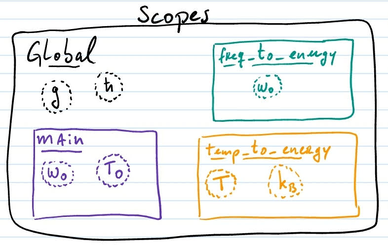
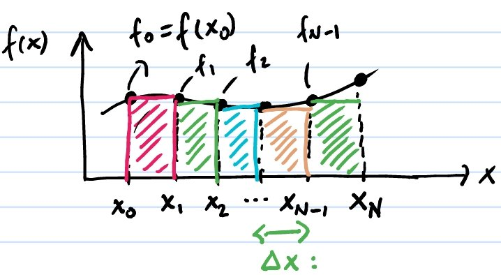

# Introduction to C

This is a brief introduction to the C language. Please follow the tutorials and books on the course references for more details.

[[_TOC_]]

## Hello world!

Let's start with the traditional code:

```c
// file hello.c
#include <stdio.h>

int main() {

    printf("Hello, world!\n");

    return(0);
}
```

Here we include the `stdio` library, which contains the input and output (i/o) functions. In this case we are using the `printf` function, which means *print formatted*, and allow us to print text and data to the screen, files, etc.

The `main` function is indeed the main function of all C codes. It always start with the main function. In this case it simply prints the message and breaks the line at the end (`\n` means break line). The `int` statement before the `main` tells the compiler that the function must return an *integer*. In this case it returns 0, but returns where?

To answer that, let's compile and run to check it. To compile, open the terminal and run the line below. It compiles the file `hello.c` and produces the binary `hello.out`.

```bash
$ gcc hello.c -o hello.out
```

To test it, run these lines and I'll comment on these next:

```bash
$ ./hello.out
$ echo $?
```

The first line runs the code, which prints the message. The `./` simply indicates that the binary is in the current folder instead of trying to find it on the `$PATH` **environment variable**. The second line is probably printing 0. The `echo` command prints stuff on the screen, and in this case it is printing the content of the `$?` environment variable, which is the returned status of the previous command. Try changing the code to return 1 from the main function, compile and run these lines again. This status is useful if track the status of your code on [bash scripts (see Ryan's tutorial)](https://ryanstutorials.net/bash-scripting-tutorial/bash-script.php).

For more information on bash and environment variables, please check this [how to geek tutorial](https://www.howtogeek.com/668503/how-to-set-environment-variables-in-bash-on-linux/) and the [tldp short list](http://tldp.org/LDP/abs/html/internalvariables.html).

## Data types

For details check the [Tutorials Point](https://www.tutorialspoint.com/cprogramming/c_data_types.htm). Here I'll list only the basic types for us to get started.

- integers are defined by `int`, and a 4-bytes (32 bits) integer run from -2,147,483,648 to 2,147,483,647.
- real numbers are approximated by floatting point representations. A `float` has 4-bytes (32 bits) and runs from 1.2E-38 to 3.4E+38, with 6 decimal places of precision. Here 1e38 = 10<sup>38</sup>. A `double` has 8-bites (64 bits) and runs from 2.3E-308 to 1.7E+308 with 15 decimal places. 
- text is represented by `char` (single letter/character) or arrays (pointer) of `char` for strings. Each `char` uses 1 byte (8 bits).

> Check also the [Floating Point imprecision slides](FloatingPointImprecision.pdf).

Run this code to check how the precision works:

```c
// file datatypes.c
#include <stdio.h>

int main() {
    int n = 5;
    float x = 0.1;
    double y = 0.1;

    printf("The value of n = %d\n", n);
    printf("The value of x = %f\n", x);
    printf("The value of y = %f\n", y);

    printf("Now with more digits:\n");
    printf("The value of x = %0.30f\n", x);
    printf("The value of y = %0.30f\n", y);

    printf("Their sizes in memory\n");
    printf("n has %d bytes, integers have %d bytes\n", sizeof(n), sizeof(int));
    printf("x has %d bytes, floats   have %d bytes\n", sizeof(x), sizeof(float));
    printf("y has %d bytes, doubles  have %d bytes\n", sizeof(y), sizeof(double));

    return(0);
}
```
Here the `%d` and `%f` (**format placeholder**) indicates that an integer and a float or double will be printed in that positions, and their values follow in order after the string as the second, third, ... arguments of `printf`. The format placeholders follow the syntax:

    %[parameter][flags][width][.precision][length]type

and a good description of each term is shown at the [printf on wikipedia](https://en.wikipedia.org/wiki/Printf_format_string#Syntax). Each term under [] is optional, while the type is required. On the code above, the `%0.30f` placeholders are using width=0, meaning that *at least* 0 characters will be printed (quite trivial in this case), and precision=30 specifies the *maximum* number of digits to be printed.

The `sizeof` command returns the number of bytes of that data type.

## Functions and scope of variables

Let's start recalling the concept of functions in mathematics. For instance:

- let f:R→R be the function f(x) = x<sup>2</sup>.  Here the first statement tell us that f takes a real parameter and returns a real parameter, so it defines the types. On the second form it shows the actual application of the function on a generic real parameter x.
- let g:Z→R be the function g(n) = 1/n. Here the function takes an integer parameter and returns a real number. Again, the first form defines the types and the second form is the application on a generic integer n.
- let h:(R,R)→R be the function h(x,y) = x<sup>2</sup> + y<sup>2</sup>. Here f takes two real parameters and return a single real number. In this case the application is the sum of the squares.

In C a similar structure follows, but both the types and the application are set together. The examples above would be written in C as:

```c
float f(float x) {
    return(x*x);
}

float g(int n) {
    return(1.0/n);
}

float h(float x, float y) {
    return(x*x + y*y);
}
```

Within a function, you are free to define **local** variables. For instance:

```c
#include <stdbool.h>

bool is_xy_inside_R(float x, float y, float R) {
    float r2 = x*x + y*y;
    if (r2 <= R*R) {
        returns(true);
    } else {
        returns(false);
    }
}
```
Here we are introducing the `stdbool.h` library that defines the Boolean type `bool` and its `true/false` values. The variable `r2` is a **local variable**, and it means that its **scope** is the function and it is not defined outside the function. All function arguments (x,y, and R in this case) are also local variables. We'll discuss the scope concept next.

> What if I want to return more than one value? For instance: how to define a function that takes float parameters (a,b,c) and returns the Bhaskara roots x1 and x2? That's easy in Python... but in C requires pointers.

#### Scope of variables

The scope of a variable refers to the region of the code where the function is defined, i.e., where the function exists and can be accessed.

Consider the example:

```c
#include <stdio.h>

int g = 0; // a global variable
const float hbar = 0.658211; // [meV.ps] as a constant global

// a function that depends on a global variable
float freq_to_energy(float w0) {
    return (hbar*w0);
}

// a function that uses the macro
float temp_to_energy(float T) {
    float kb = 0.086173; // [meV/K] as a local variable
    return (kb*T);
}

int main() {
    float w0 = 3.0; // rad/s
    float T0 = 10; // K

    printf("w0 in energy is %f meV\n", freq_to_energy(w0));
    printf("10 rad/s in energy is %f meV\n", freq_to_energy(10));

    printf("T0 in energy is %f meV\n", temp_to_energy(t0));

    return(0);
}
```

The variables exist only within the region where they are declared. Check the diagram below.



The global scope is set out of any function and can only contain variables and values, no processing. TThe variables in the global scope are available to all functions of the code.

In this case the global variables are *g* and *hbar*. It's **highly recommended** to use only constant global variables, as hbar, such that the code cannot change its value. Let's avoid using free global variables as *g*, since it makes the functions [impure (check the link)](https://en.wikipedia.org/wiki/Pure_function).

Each function defines its **local scope**. So, in the *main* function, the variables *w0* and *T0* are local and only exists within the *main* function. When we call `freq_to_energy(w0)`, the *w0* within the *freq_to_energy* function is not the same variable as *w0*. It has the same name, but it is not the same variable. Let's refer to the variable in its scope as **scope:variable**. When we call `freq_to_energy(w0)`, the content of *main:w0* is **copied** to *freq_to_energy:w0* (i.e. passing parameters by value, see Pointers for passing parameters by reference). When we call `freq_to_energy(10)` in the next line, the value 10 is attributed to *freq_to_energy:w0* only, and not to *main:w0*.

The *temp_to_energy* function has two variables in its scope: *T* and *kb*. Therefore *kb* can only be accessed within this function, differently than *hbar*. Notice that **CONSTANT global variables** are useful for physical constants.

## Loops: sums, integrals, recurrence, ...

Loops are a natural form to implement repetitive calculation like:

- sums and integrals: $`S=\sum_i f_i`$
- products: $`P = \Pi_i f_i`$
- recurrence relations: $`a_n = a_{n-2} + a_{n-1}`$
- ...

Check this [[youtube video (in Portuguese)]](https://www.youtube.com/watch?v=6sgL0-s33KA).

#### The loops for and while

A `for` loop has the generic form

```c
for (init; condition; increment) {
    // repetitive code here
}
```

While a `while` loop in a generic form is

```c
init
while (condition) {
    // repetitive code here
    increment    
}
```

They are equivalent. But I prefer `for` over `while` when possible. The elements in both are:

- **init**: here we initialize the variable that will vary on our loop, e.g. `i=0`.
- **condition**: the loop will run while the condition is satisfied, e.g. `i<10`.
- **increment**: how to change `i` from one loop to the other, e.g. `i++`, `i--`, `i+=2`.
- **repetitive code**: the actual code that will run for each element of the loop.

Let's check two examples.

#### Sums and integrals

The simplest numerical implementation of an integral is given simply by its calculus definition without the limit $`\Delta x \rightarrow 0`$, thus it reads

```math
S = \int_a^b f(x) dx \approx \sum_{i=0}^{N-1} f(x_i) \Delta x
```

There the *x* axes is discretized as $`x \rightarrow x_i = a + i \Delta x`$, and *i* runs from 0 to *N-1*. Notice that for *i=0*, $`x_0 = a`$ and for *i=N*, $`x_N = b`$, as illustrated in the figure below. From the expression for $`x_i`$, we also have $`x_N = a+N\Delta_x`$, therefore $`\Delta x = (b-a)/N`$.



To implement the sum above, our `init` statement will set the initial value of *i* as `i=0`, and the `condition` will define the limit of the sum as `i<N` or `i<=N-1`. The repetitive code is to add $`f(x_i)\Delta x`$ for each *i*. Therefore, the loop reads

```c
// assuming a function
//    float f(float x);
// is defined somewhere
float xi, dx; // for the discrete x
float a, b; // define the integration limits
float S; // to store the sum
int N; // define number of points
S = 0.0; // init the sum with the neutral element
for (int i=0; i<N; i++) {
    xi = a + i*dx; // calculate xi
    S += f(xi)*dx; // add element to sum for each i
}
```

For more details check:

- [Numerical_integration on Wikipedia](https://en.wikipedia.org/wiki/Numerical_integration)
- [The Simpsons rule](https://en.wikipedia.org/wiki/Simpson%27s_rule)
- [Monte Carlo integration](https://en.wikipedia.org/wiki/Monte_Carlo_integration)
- Advanced integration routines with the [GNU Scientific Library (GSL)](https://www.gnu.org/software/gsl/doc/html/integration.html)

#### Product over a set

A product is technically very similar to the sum. For instance, consider the factorial

```math
n! = \Pi_{i=1}^N i
```
In this case we init the loop with *i=1* and run it while *i<=N*, the code reads

```c
int p = 1; // init the product the neutral element
for (int i=1; i<=N; i++) {
    p *= i; // p receives itself times i
}
```

## Pointers

Pointers are variables that store the memory address of another variable, i.e. it points to this variable content. It is mostly useful for three purposes:

1. Passing arguments by reference instead of value.
2. Returning more than one result from a function.
3. Arrays: vectors and matrices.

**Notation**

- To declare a pointer use * as: `int *p;`, `float *p;`, etc...
- The address of a variable is returned by &. So the code `p = &a;` stores the address of *a* into *p*.
- The value stored in an pointer can be accessed with * as in `b = *p;`. Here *b* receives the value stored in the address pointed by *p*. If *p* has the address of *a*, than *b* will be getting the value of *a* here.

#### Arguments by value or reference

First, consider this very simple example that passes arguments by value:

```c
int largest(int a, int b) {
    if (a > b) return (a);
    return(b); // else
}

int main() {
    int c = 2;
    int d = 10;
    printf("The largest is: %d\n", largest(c,d));
    return(0);
}
```

When we call `largest(c,d)`, the content of the variables *c* and *d* are **copied** to the local variables *a* and *b* in the function *largest*. Typically this is not a problem, but if *c* and *d* were large matrices instead of simple integers, this process could be copying a lot of data and slow down the code (luckily it is not possible to pass matrices by value in C, since matrices are pointers anyway).

Now let's change it to sort the values of *a* and *b* and return the largest value in *a* and the smallest in *b*. This requires passing variables by reference.

```c
void sort2(int *a, int *b) {
    int c; // auxiliary for the flip
    if (*a < *b) {
        c = *b; // c saves original value of b
        *b = *a; // moves content of a to b
        *a = c; // recovers original value of b into a
    }
    // else: nothing to do, already sorted
}

int main() {
    int c = 15;
    int d = 10;

    sort2(&c, &d); // pass by reference

    printf("The smallest is: %d\n", c);
    printf("The largest is: %d\n", d);
    return(0);
}
```

In this case the function *sort2* receives two pointers, that is: two address rather than the values. When we call `sort2(&c, &d);` on *main*, we are passing to *sort2* the address of *c* and *d*. Consequently, *sort2* can access and change the content of these variables that are **on a different scope!**

#### Arrays: vectors and matrices

In C, arrays (vectors and matrices) are arrays or pointers. There are many ways to define and initialize these. 

Let's start with **vectors**. 

These first two forms are identical declaration and initialization of arrays:

1. `float x[5] = {0.0, 2.0, 4.0, 6.0, 8.0}`;
2. `float x[] = {0.0, 2.0, 4.0, 6.0, 8.0}`;

The 1st from informs that the array *x* **must** have 5 elements, while on the 2nd it is not specified. So use the first form to double check that you are not using the wrong number of entries. You can also declare it empty and later initialize it as:

3. Initialize empty and use a loop to fill it:

```c
int n=5;
float x[n];
for (int i=0; i<n; i++) {
    x[i] = 2.0*i;
}
```

> In all cases above, *x* is implicitly a pointer. To make it clear, `x[0]` refers to the first element of the array, while `x` by itself refers to the address where the array is stored.

4. If we don't know the size of the vector beforehand, or if we want to change it during the code, we have to use a pointer explicitly and call a function to allocate the array:

```c
int n;
int *x;

printf("Enter a value for n: ");
scanf("%d", &n); // see input/output below

// allocates the array in memory
x = (int *) calloc(n, sizeof(int));

// initializes it
for (int i=0; i<n; i++) {
    x[i] = 2.0*i;
}

// releases the array from memory
free(x);
```

Here the `calloc` function reserves/allocates a space in memory for n slots for integer variables. It requires a cast  `(int *)` to make its return type explicit. Every time we allocate manually, it is necessary to `free` the array at the end once it is not needed anymore to avoid **memory leaks**.

Now let's see how we can define and use **matrices**.

> TO DO

#### Passing arrays, vectors and matrices as parameters to functions

> TO DO

## Input & Output

> TO DO

#### Arguments on the main function

> TO DO

```c
int main(int argc, char *argv[]) {

    // TO DO

    return(0);
}
```

## Complexity of an algorithm

> TO DO
