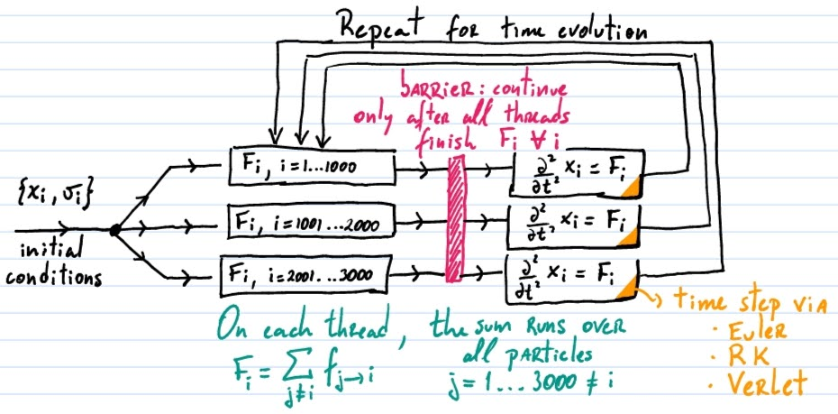

# OpenMP

[[_TOC_]]

[OpenMP](http://openmp.org/) (Open Multi-Processing) is an API to implement parallel programming on a single multi-core computer. It allows you to split your code into different threads that run in parallel to execute different tasks. In contrast, to run parallel codes in many computers or on a cluster, it's intereting to combine openMP with [open MPI](https://en.wikipedia.org/wiki/Message_Passing_Interface).

For a simple illustration on how it can be useful in physics, consider an integral split into sub-intervals:

```math
\int_a^e f(x) dx = 
\int_a^b f(x) dx +
\int_b^c f(x) dx +
\int_c^d f(x) dx +
\int_d^e f(x) dx
```

Since each contribution above is independent from the others, they can be split into 4 threads and run in parallel. If you computer has 4 cores, you might gain a **speedup** of 4, that is, the code will run 4 times faster. This is the ideal case. After each thread finishes their part of the integral, the partials are combined with a **reduction**, as illustrated in the diagram below.


The same idea can be applied to 2D integrals over an area split into sub-areas, 3D volume integrals or higher dimensional integrals. Equivalently, the same procedure is valid for sums and products:

```math
\sum_{i=1}^{4000} f_i = 
\sum_{i=1}^{1000} f_i +
\sum_{i=1001}^{2000} f_i +
\sum_{i=2001}^{3000} f_i +
\sum_{i=3001}^{4000} f_i
```

```math
\Pi_{i=1}^{4000} f_i = 
\left[ \Pi_{i=1}^{1000} f_i \right] \times
\left[ \Pi_{i=1001}^{2000} f_i \right] \times
\left[ \Pi_{i=2001}^{3000} f_i \right] \times
\left[ \Pi_{i=3001}^{4000} f_i \right]
```

For instance, the sums above appear on **molecular dynamics** codes. The total force acting on each particle *i* is $`F_i = \sum_{j\neq i} f_{j\rightarrow i}`$, where $`f_{j\rightarrow i}`$ is the force of a particle *j* on *i*. One can parallelize this by running a set of $`\{F_i\}`$ on each thread, thus allowing for simulations with a large number of particles. In this case we have to be careful with the sequential part of the calculation. To perform the time evolution (using the Euler or RK methods), all threads must first finish calculating the forces. This requires a **barrier**, as illustrated in this diagram:



Other examples are the differential operators. Take for instance **the heat equation** in 2D,

```math
\dfrac{\partial}{\partial t}u(x,y,t) = \nabla^2 u(x,y,t)
```

If we want to solve this equation on a large area *A* (or in 3D on a large volume *V*) discretized in a large number of points, it might be interesting to split the laplacian calculation into sections of the area *A*.

Another common example is the semi-classical **Ising code** for magnetism via **Monte Carlo** and the **Metropolis** algorithm. This type of code requires an **ensemble average** over many samples, which can be naturally run in parallel.

For more examples, see the references and the **papers** below.

### References

Online documentation, tutorials and classes:

- The official webpage: http://openmp.org/
- Official documentation for [gcc+openMP](https://gcc.gnu.org/wiki/openmp), check the specs for version 4.5. Check also the specs on the [openMP webpage](https://www.openmp.org//specifications/), there they have some examples
- Wikipedia: https://en.wikipedia.org/wiki/OpenMP
- Excellent and complete tutorial: [A “Hands-on” Introduction to OpenMP](https://www.openmp.org/wp-content/uploads/omp-hands-on-SC08.pdf)
- A simpler tutorial: [Using OpenMP with C
](https://curc.readthedocs.io/en/latest/programming/OpenMP-C.html)
- Not so quick [Guide into OpenMP](https://bisqwit.iki.fi/story/howto/openmp/)
- Class on [Introduction to Parallel Computing](https://computing.llnl.gov/tutorials/parallel_comp/#ExamplesHeat) with more technical details
- If you want to learn about MPI as well, for now check [official webpage](https://www.open-mpi.org) and [Wikipedia](https://en.wikipedia.org/wiki/Message_Passing_Interface)

Good books:

- W. P. Petersen, P. Arbenz - **Introduction to parallel computing [a practical guide with examples in C]** - Oxford University Press (2004)

Papers:

- F. Esquembre, W. Christian, M. Belloni - **Parallel programming with Easy Java Simulations** - [Am. J. Phys. 86 (2018)](https://doi.org/10.1119/1.5012510)
- C. Rebbi - **A project-oriented course in computational physics: Algorithms, parallel computing, and graphics** - [Am. J. Phys. 76 (2008)](https://doi.org/10.1119/1.2839093)


## Introduction

Before discussing how to code with openMP in C, let's just list here some important information for reference:

1. **To use openMP** in a C code, include the library `#include <omp.h>`, and compile in gcc using the `-fopenmp` flag.
2. **The number of threads** can be set within the code, but a default value can be set with the environment variable `OMP_NUM_THREADS`.
3. **Pragmas** are compiler directives that instruct the compiler on how to read the code and build the binary. OpenMP uses pragmas to instruct the compiler on how to parallelize and control the code.

### Hello many worlds!

Let's split the code in threads and ask each thread to say hello.

```c
#include <stdio.h>
#include <omp.h>

int main() {
    int id;
    omp_set_num_threads(4); // set the number of threads

    // informs the compiler to run the following block {...}
    // on all threads in parallel
    #pragma omp parallel
    {
        // gets the current thread id
        id = omp_get_thread_num();
        // and prints the message informing the id
        printf("Hello from world %d!\n", n);
    }
   
    return(0);
}
```

The `#pragma omp parallel` is the most basic structure in openMP. It is followed by a block defined by the {...}. This block will run on all threads in parallel. To identify the thread, an id can be extracted from the `omp_get_thread_num()` function.

### Sums and reduction

Let's check a code that splits the sum below in threads. For this example we consider $`f_i = 1/i`$, but please feel free to change it to something more interesting.

```math
\sum_{i=1}^{4000} f_i = 
\sum_{i=1}^{1000} f_i +
\sum_{i=1001}^{2000} f_i +
\sum_{i=2001}^{3000} f_i +
\sum_{i=3001}^{4000} f_i
```


```c
#include <stdio.h>
#include <omp.h>

// sum from i0 to i1
float partial_sum(int i0, int i1) {
    float partial = 0.0;
    for (int i=i0; i<=i1; i++) {
        partial += 1.0/i;
    }
    return(partial);
}

int main() {
    int i0, i1;
    float total;
    omp_set_num_threads(2); // set the number of threads

    // pragma to run the loop in parallel and collect the 
    // content of total on each thread to sum up into 
    // the final value
    #pragma omp parallel for reduction(+:total) private(i0,i1)
    for (int i=0; i<4; i++) {
        i0 = 1 + i*1000; // lower limit of each sum
        i1 = (1+i)*1000; // upper limit of each sum
        total += partial_sum(i0, i1); // run each sum
    }

    // prints the result
    printf("Total sum is %f\n", total);
   
    return(0);
}
```

The `#pragma omp parallel for` runs each element of the loop in a different thread. Notice that the number of threads do not need to match the number of elements in the loop. In this example **only 2 threads** will be used to run the sum **split into 4 partials**. This means that two partials will be run in parallel, and once one is finished the next is called until all 4 partials are finished. 

The `reduction(+:total)` option tells openMP that it should collect the value of the variable `total` obtained on each thread and sum them following the rule indicated in the line that contains `total += ...`. The compiler must be able to identify this reduction, so a line like the `total += ...` is always need for the reduction to work. The reduction can also be applied to products by replacing the + operator with a *.

The `private(i0,i1)` option tells openMP that the variables `i0` and `i1` are to be considered as **private** variables for each thread. There is, they are local and have different values on each thread. If not informed, variables are assumed to be **shared** between threads. The variable set on the `reduction(+:total)` call is always shared.

## The openMP pragmas

Let's try to list here the main pragmas and options that can be useful for our codes and exercises. Remember that all pragmas must be follow by a block code, which can be set by `{...}` or a loop.

**Disclaimer:** the list below is far from complete, but already give us a lot to work on within the purposes of this introductory course. For more details please check the references above.

**The pragmas**

- `#pragma omp parallel`: the most simple pragma, it runs the block that follows it in parallel on all threads.
- `#pragma omp critical`: only one thread should run this section at a time. For instance, when writing to a file. If two threads try to write to the same file at once, it may write things out of order.
- `#pragma omp parallel for`: each element of the loop will be run on a thread. If there are 100 elements in the loop and only 4 threads, the 4 threads will take turn running 4 elements each time until they run all 100 elements.
- `#pragma omp parallel for reduction (op:var)`: loops into the **for loop** for a an operation (`op` = + or *) on the variable `var` and collects its partial data to be composed with the `op` operator into the final result.
- `#pragma omp barrier`: creates a barrier informing that the parallel code on each thread must stop there until all threads reach this barrier. On they all get there, the code continues.
- `#pragma omp master`: only the master thread (id=0) will run this section.
- `#pragma omp single`: any but only one thread will run this section.

**The options**

The options below must follow the pragmas. For instance, `#pragma omp parallel num_threads(10)` informs that the block that follows will be run in 10 threads.

- `num_threads(n)`: inform the number of threads *n* to be used by the block.
- `private(<list of vars>)`: inform that this list of variables will be local to each thread. In this case the vars must be initialized on each thread.
- `firstprivate(<list of vars>)`: similar to private, but the private vars on each thread are initialized with the values they had on the previous scope.
- `lastprivate(<list of vars>)`: the vars will retain their last values once the parallel code ends the sequential code continues.

## Auto-parallelization

The gcc compilation flag `-ftree-parallelize-loops` seems to be quite interesting:

> **-ftree-parallelize-loops=n**
    Parallelize loops, i.e., split their iteration space to run in n threads.  This is only possible for loops whose iterations are independent and can be arbitrarily reordered.  The optimization is only profitable on multiprocessor machines, for loops that are CPU-intensive, rather than constrained e.g. by memory bandwidth.  This option implies -pthread, and thus is only supported on targets that have support for -pthread.

I'll check it and add an example here soon.
