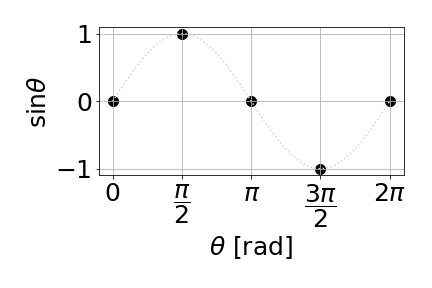

Interpolation
=============

Interpolation is a technique to infer information from a discrete and limited set of data. For instance, it is the root of numerical integration schemes, where one infer the shape of the curve between discrete points following some interpolation pattern.

Here we'll discuss simple interpolation schemes: linear and quadratic interpolation; and an introduction to quadratic spline interpolation. For more information, please check the **book by Tao Pang** and the `Wikipedia: Interpolation <https://en.wikipedia.org/wiki/Interpolation>`_.

As a simple example, we'll consider this figure of sine function with only 5 points in all cases below.

Linear interpolation
--------------------

A linear interpolation considers a straight line connecting each pair of consecutive points. The set of 5 discrete points above are :math:`(x_i, y_i)`, with *i=0..4*. To interpolate we must fine the equation of aline connecting the dots. This is very simple, but let's do it in details, since the same approach can be used for more complex interpolations.

We want to find the coefficients from :math:`y(x) = a x + b` within the domain :math:`[x_i, x_{i+1}]`. We use the known points to write the equations

.. math::
    \begin{align}
        y_i &= a x_i + b
        \\
        y_{i+1} &= a x_{i+1} + b
    \end{align}

These equations can be casted in a matrix form

.. math::
    \begin{pmatrix}
        x_i & 1 \\
        x_{i+1} & 1
    \end{pmatrix}
    \begin{pmatrix}
        a \\ b
    \end{pmatrix}
    =
    \begin{pmatrix}
        y_i \\ y_{i+1}
    \end{pmatrix}

This is a very simple equation that can be solved by hand, but for more complex cases you could used `np.linalg.solve(...)` to solve the *linear system of equations*. You'll find

.. math::
    \begin{align}
        a &= \dfrac{y_{i+1} - y_i}{x_{i+1} - x_i}
        \\
        b &= \dfrac{y_{i} x_{i+1} - y_{i+1} x_i}{x_{i+1} - x_i}
    \end{align}

Applying this linear interpolation to the sine function above, we get this figure below.

.. tabs::

    .. tab:: Linear interpolation

        .. image:: ./figs/sin-linear.png
            :width: 50%
            :align: center
    
    .. code-tab:: py The code
        :linenos:
        
        import numpy as np
        import matplotlib.pyplot as plt
        plt.rcParams.update({'font.size': 25})

        #----------------------------
        # my linear interp function
        #----------------------------
        def linear_interp(x, y, npts):
            # init arrays
            xs = np.linspace(x[0], x[-1], npts)
            ys = np.zeros_like(xs)
            # init first point
            ys[0] = y[0]

            # loop over sections set by original points
            for i0 in range(len(x)-1):
                # init line equation at this section
                a = (y[i0+1]-y[i0])/(x[i0+1]-x[i0])
                b = (y[i0]*x[i0+1]-y[i0+1]*x[i0])/(x[i0+1]-x[i0])
                # extract xs indexes within x-section range
                # i.e., points where x[i0] < xs < x[i0+1]
                js = np.argwhere((xs > x[i0]) & (xs <= x[i0+1]))[:,0]
                # apply linear interpolation over this range
                ys [js] = a*xs[js] + b
            # return results
            return xs, ys

        # generate original points
        x = np.linspace(0, 2*np.pi, 5)
        y = np.sin(x)# + np.random.normal(0, 0.2, 7)
        # exact sine with a lot of points as a reference
        xe = np.linspace(0, 2*np.pi, 100)
        ye = np.sin(xe)
        # my interpolation over the 5 points above
        x1, y1 = linear_interp(x, y, 25)

        # plot all
        plt.plot(xe, ye, ls=':', c='lightgray')
        plt.scatter(x, y, c='black', s=100)
        plt.scatter(x1, y1, c='red')
        plt.xlabel(R'$\theta$ [rad]')
        plt.ylabel(R'$\sin\theta$')
        plt.xticks([0, np.pi/2, np.pi, 3*np.pi/2, 2*np.pi], ["0", R"$\dfrac{\pi}{2}$", R"$\pi$", R"$\dfrac{3\pi}{2}$", R"$2\pi$"])
        plt.grid()
        plt.tight_layout()
        plt.show()

Quadratic interpolation
-----------------------

TO DO

Quadratic spline
----------------

TO DO

For more details check:

- *Quadratic Spline Interpolation*, Surendra Singh Rana, J. Approx. Theory 57, 300 (1989)
- `Wikipedia: Spline interpolation <https://en.wikipedia.org/wiki/Spline_interpolation>`_

Numpy and scipy methods
-----------------------

TO DO

