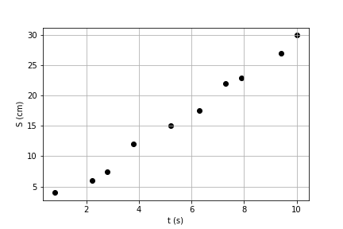

Introduction to matplotlib
==========================

**Matplotlib** is the main library for plots in python. Check its `webpage <https://matplotlib.org/>`_ for the main documentation, tutorials and examples. There's also a good discussion on `Tutorial's point <https://www.tutorialspoint.com/matplotlib/index.htm>`_.

How to organized data for a simple plot?
----------------------------------------

To plot something we need the data. Typically this means using **numpy**, which we will discuss in details on the next chapter. For now, let's check only a few **numpy commands** to help us organize the data and make plots.

Just like in your first *lab classes*, to plot something on a graph paper (*papel milimetrado* in Portuguese), you need a set of *(x,y)* points on a table.

.. list-table:: How to plot on a graph paper?
    :widths: 1 2
    :header-rows: 0

    * - 

        +--------+---------+
        |  t(s)  |  S(cm)  |
        +========+=========+
        |   0.8  |   4.0   |
        +--------+---------+
        |   2.2  |   6.0   |
        +--------+---------+
        |   2.8  |   7.5   |
        +--------+---------+
        |   ...  |   ...   |
        +--------+---------+

        The data is organized as two columns 

        corresponding to the x and y axes 

        and plotted as shown on the figure.

      - .. image:: ./figs/graphpaper.png
            :width: 99%
            :align: center

A first example
^^^^^^^^^^^^^^^

So, to prepare the data we need **a list** of points organized as the *x* and *y* coordinates. For instance, consider this first example:

.. code-block:: python
    :caption: Plot the data
    :linenos:

    import matplotlib.pyplot as plt

    # define the points as lists
    x = [ 0.8, 2.2, 2.8, 3.8, 5.2, 6.3, 7.3, 7.9, 9.4, 10.0 ]
    y = [ 4.0, 6.0, 7.5, 12, 15, 17.5, 22, 23, 27, 30 ]

    # plot as points
    plt.scatter(x, y, color='black')
    # add elements to the the figure
    plt.xlabel('t (s)')
    plt.ylabel('S (cm)')
    plt.grid()
    # finish the plot
    plt.show()

This code will give you a plot similar to the paper graph example above.

Let's understand the code:

- *x* and *y* are **simple lists** of points, where each pair of numbers form a point (x,y) just like in the table shown above. Instead of lists, these could also be **numpy arrays**.

- we have imported the **pyplot** sublibrary with the alias **plt**, which is the object that now controls our plots.

- the **scatter** command make plots with points. It takes as required arguments the list of *x* and *y* points. Optionally, you may inform the color of for the points and many other options that we'll discuss later.

- the **xlabel** or **ylabel** commands define the labels for the axes from the string arguments. You can also use Latex commands as we'll se below.

- the **grid** command adds the vertical and horizontal grids. It's not necessary, but sometimes makes the plot easier to read.

- the **show** command finishes the plot and show the results. It's not always needed, but **I strongly recommend** that you always finish the plot calling the *show* command for safety.

But it is missing the red line that fits the data! Let's add it using **numpy** as in this next example:

.. code-block:: python
    :caption: Plot the data and fit with a polynomial
    :linenos:

    import matplotlib.pyplot as plt
    import numpy as np

    # now we need x and y to be numpy arrays
    x = np.array([ 0.8, 2.2, 2.8, 3.8, 5.2, 6.3, 7.3, 7.9, 9.4, 10.0 ])
    y = np.array([ 4.0, 6.0, 7.5, 12, 15, 17.5, 22, 23, 27, 30 ])

    # fit the data as a polynomial of order 1: y = c0*x¹ + c1
    c = np.polyfit(x, y, 1)
    # apply fit on x to get the fitted yf
    yf = c[0]*x + c[1]

    # plot the points
    plt.scatter(x, y, color='black')
    # and plot the fitted line
    plt.plot(x, yf, color='red')
    # add elements
    plt.xlabel('t (s)')
    plt.ylabel('S (cm)')
    plt.grid()
    # and finish the plot
    plt.show()

The figure now looks quite similar to the graph paper example above.

.. list-table:: Pyplot figure matching the example above with points and fit
    :header-rows: 0

    * - .. image:: ./figs/ex1-fit.png
            :width: 99%
            :align: center

      - .. image:: ./figs/graphpaper.png
            :width: 99%
            :align: center

Let's discuss the new elements in the second example above.

- instead of lists, now *x* and *y* are defined as **numpy arrays** so we can operate on them as mathematical vectors.

- the **polyfit** command from numpy returns the coefficients of fitted polynomial, the parameter 1 at the end indicates the order of the polynomial. For instance, if we had fitted for a polynomial or order *n=2*, the coefficients would represent :math:`y = c_0 x^2 + c_1 x + c_2`... notice that the indexes of the coefficients go from 0 to n, while the powers of x go from n to 0... it's awful, but blame the numpy devs, not me! At line 11 we define *yf* as an array composed by :math:`y_f = c_0 x + c_1`. 

- while the **scatter** command plot points, the **plot** command plots lines connecting the points defined by the lists or arrays *(x, yf)*, and now we choose the color red to match the paper graph example.

.. note::
    Here I'm using the **polyfit** from numpy because it is quite simple to use. However, for more complicated fits it is better to use the **curve_fit** command from **scipy**.

Make it look good!
------------------

Now let's check another example using trigonometric functions that will allow us to discuss many details on how to improve the plot. Let's start small with a very simple plot.

.. tabs::

    .. code-tab:: py The code
        :linenos:

        import numpy as np
        import matplotlib.pyplot as plt

        x = np.linspace(0, 2*np.pi, 100)
        y1 = np.sin(x)
        y2 = np.cos(x)

        plt.plot(x, y1)
        plt.plot(x, y2)
        plt.show()
    
    .. tab:: The plot

        .. image:: ./figs/ex2-step1.png
            :width: 75%
            :align: center
    
    .. tab:: The new commands

        - **np.linspace(x0, xf, xpts)** creates an array of *xpts* from x0 to xf.

        - **np.sin / np.cos** not only calculates the trigonometric functions, but does it for all points in the array *x*. This is called a **broadcast** and it is one of the main advantages of using numpy, as we'll see in more details on the next chapter.

How can we improve it?

- make the fonts larger;
- add labels using Latex to get greek symbols like :math:`\theta`;
- add legends;
- change the line style;
- save the figure;
- ...

Let's try one by one. First let's increase the font size.

.. tabs::

    .. code-tab:: py Font size
        :linenos:

        import numpy as np
        import matplotlib.pyplot as plt

        plt.rcParams.update({'font.size': 16})

        x = np.linspace(0, 2*np.pi, 100)
        y1 = np.sin(x)
        y2 = np.cos(x)

        plt.plot(x, y1)
        plt.plot(x, y2)
        plt.ylabel('Trigonometric functions', fontsize=18)
        plt.show()

        # extra: check default rc parameters file at:
        import matplotlib
        print(matplotlib.matplotlib_fname())

    
    .. tab:: The plot

        .. image:: ./figs/ex2-step2.png
            :width: 75%
            :align: center
    
    .. tab:: The new commands

        the **rcParams** define the matplotlib configuration and can be updated as shown in the example using dictionaries with the parameter names and values. There, the 'font.size' parameter will apply to all text in the plot. Alternatively, you can also specify the 'fontsize' in specific elements of the plot, as in the **ylabel** line.

        The default parameters are set in a text file. The last lines, after *extra* prints the location of this textfile. For more information, check the `matplotlibrc file documentation <https://matplotlib.org/3.3.2/tutorials/introductory/customizing.html>`_. The link has a sample of the default *matplotlibrc* file with the default parameters.

.. warning::
    You should never edith the **matplotlibrc** default file, as it gets overwritten if you reinstall or update matplotlib. Instead, always make a copy to the user location.

    On windows: ``c:/users/<nameoftheuser>/.matplotlib/matplotlibrc``

    On Linux: ``~/.config/matplotlib/matplotlibrc``

Now let's use Latex on the labels and add legends.

.. tabs::

    .. code-tab:: py Labels and legends with Latex
        :linenos:

        import numpy as np
        import matplotlib.pyplot as plt
        plt.rcParams.update({'font.size': 20})
        plt.rcParams.update({'text.usetex': True})

        x = np.linspace(0, 2*np.pi, 100)
        y1 = np.sin(x)
        y2 = np.cos(x)

        plt.plot(x, y1, label=R'$\sin\theta$')
        plt.plot(x, y2, label=R'$\cos\theta$')
        plt.legend(fontsize=15)
        plt.xlabel(R'$\theta$ [rad]')
        plt.ylabel(R'Trigonometric functions')
        plt.tight_layout()
        plt.show()
    
    .. tab:: The plot

        .. image:: ./figs/ex2-step3.png
            :width: 75%
            :align: center
    
    .. tab:: The new commands

        - Now we are updating the rcParams to set the option **text.usetex = True**.

        - On the *plot* commands, we add the option **label** that will be used by the command *plt.legend()* to create the legends. 

        - On all labels we add an **R** before the strings to inform that the string should be read as it is (*raw*). This is needed to pass their values correctly to Latex.

Notice in the figure above that now all fonts are set to the Computer Modern font from Latex.

Now let's make it look good!

.. tabs::

    .. code-tab:: py Full example
        :linenos:
        
        import numpy as np
        import matplotlib.pyplot as plt
        plt.rcParams.update({'font.size': 20})
        plt.rcParams.update({'text.usetex': True})
        plt.rcParams.update({'text.latex.preamble' : r'\usepackage{amsmath}'})

        x = np.linspace(0, 2*np.pi, 100)
        y1 = np.sin(x)
        y2 = np.cos(x)
        y3 = np.tan(x)

        plt.figure(figsize=(6, 5))
        plt.plot(x, y1, label=R'$\sin\theta$')
        plt.plot(x, y2, label=R'$\cos\theta$', ls='--')
        plt.plot(x, y3, label=R'$\tan\theta$', ls='-.')
        plt.legend(fontsize=15, loc=(0, 1.05), ncol=3)
        plt.xlabel(R'$\theta$ [rad]')
        plt.ylabel(R'Trigonometric functions')
        plt.xticks([0, np.pi/2, np.pi, 3*np.pi/2, 2*np.pi], ["0", R"$\dfrac{\pi}{2}$", R"$\pi$", R"$\dfrac{3\pi}{2}$", R"$2\pi$"])
        plt.xlim(0, 2*np.pi)
        plt.ylim(-2, 2)
        plt.grid()
        plt.tight_layout()
        plt.savefig('ex2-step4.png', dpi=300)
        plt.show()

    
    .. tab:: The plot

        .. image:: ./figs/ex2-step4.png
            :width: 75%
            :align: center
    
    .. tab:: The new commands

        - rcParams allow you to inform a Latex preamble, where you can import your Latex packages;

        - the **line style** parameter (**ls**) in *plt.plot* allows you to choose between solid ('-'), dashed ('--'), dash-dot ('-.'), and dotted (':'). For more, check `the documentation <https://matplotlib.org/api/_as_gen/matplotlib.pyplot.plot.html#matplotlib.pyplot.plot>`_ and this `more advanced example <https://matplotlib.org/gallery/lines_bars_and_markers/linestyles.html#sphx-glr-gallery-lines-bars-and-markers-linestyles-py>`_;

        - now the **legend** is specified with a location (*loc*) and number of columns (*ncol*). For more options, check `the documentation <https://matplotlib.org/api/legend_api.html?highlight=legend#module-matplotlib.legend>`_;

        - the **x ticks** are now explicitly set on the most relevant points, and the numbers are replaced by labels using Latex. Notice that the first parameter is a list of points and the second a list of strings replacing those points. The same could be applied for the **y ticks**;

        - The **xlim** and **ylim** define the ranges of the plot. It's needed now because the tangent diverges at pi and 2pi.

        - The **tight_layout()** command is really important! It makes small adjustments to fit the figure into the bounding box, otherwise the figure could be cropped. It's even more important when using *subplots* (see below).

        - The last command saves the figure into a file. The file type is set by the extension (png, jpg, svg, pdf, ...). Additionally, I'm setting the **dpi** to improve the resolution of the pnf file. Another interesting parameter to check is **transparent = True**, try it!

Panels (subplots) and insets
----------------------------

Let's see examples how to break your figure into panels and insets. We'll use the *plt.text* command to place labels (a), (b), ...

**Insets** are a figure within another. Let's use it to plot the damped oscillations in a large and small scales.

.. tabs::

    .. code-tab:: py Using insets
        :linenos:
        
        import numpy as np
        import matplotlib.pyplot as plt
        plt.rcParams.update({'font.size': 20})
        plt.rcParams.update({'text.usetex': True})
        plt.rcParams.update({'text.latex.preamble' : r'\usepackage{amsmath}'})

        x = np.linspace(0, 5, 2000)
        y = np.sin(200*x) * np.exp(-x)

        plt.figure()

        plt.plot(x, y)
        plt.xlabel(R'$t$')
        plt.ylabel(R'$y(t)$')

        # get the main axes
        ax = plt.gca() 
        # define the inset axes
        ins = ax.inset_axes([0.6, 0.6, 0.37, 0.37])

        # plot whathever you need as a sub-range of the main plot
        ins.plot(x, y)
        ins.set_xlim(1.5, 1.7)
        ins.set_ylim(-0.3, 0.3)
        ins.set_xticklabels('')
        ins.set_yticklabels('')

        # draws the zoom box
        ax.indicate_inset_zoom(ins)

        plt.tight_layout()
        plt.show()        

    
    .. tab:: The plot

        .. image:: ./figs/ex3-inset.png
            :width: 75%
            :align: center
    
    .. tab:: The new commands

        - **plt.gca()** gets the current axes. This object is needed when dealing with multiple axes.

        - **inset_axes([x0, y0, dx, dy])** defines the axes location at (x0,y0) with size (dx,dy). These numbers are specified with resect to the parent axes and range from 0 to 1.

        - when acting on the **axes object**, we need to use *set_xlim* instead of *xlim* as in the previous examples. We have also set *set_xticklabels* to blank.

        - the last command **indicate_inset_zoom** is optional, but awesome for this kind of inset that represents a zoom. It draws the zoom box by connecting the ranges of the main axes and the inset axes.

Another useful structure is to break your plot into panels, as in the example below.

.. tabs::

    .. code-tab:: py Subplots on simple grid
        :linenos:
        
        import numpy as np
        import matplotlib.pyplot as plt
        plt.rcParams.update({'font.size': 20})
        plt.rcParams.update({'text.usetex': True})
        plt.rcParams.update({'text.latex.preamble' : r'\usepackage{amsmath}'})

        x = np.linspace(-10, 10, 100)
        y1 = np.sin(x)/x
        y2 = np.exp(-x**2)
        y3 = np.tanh(x)
        y4 = x**2

        plt.figure(figsize=(8,5))

        plt.subplot(2, 2, 1)
        plt.plot(x, y1)
        plt.xlabel(R'$x$')
        plt.ylabel(R'$\sin(x)/x$')
        plt.text(0.05, 0.75, R'(a)', transform=plt.gca().transAxes)

        plt.subplot(2, 2, 2)
        plt.plot(x, y2)
        plt.xlabel(R'$x$')
        plt.ylabel(R'$g(x)$')
        plt.text(0.05, 0.75, R'(b)', transform=plt.gca().transAxes)

        plt.subplot(2, 2, 3)
        plt.plot(x, y3)
        plt.xlabel(R'$x$')
        plt.ylabel(R'$\tanh(x)/x$')
        plt.text(0.05, 0.75, R'(c)', transform=plt.gca().transAxes)

        plt.subplot(2, 2, 4)
        plt.plot(x, y4)
        plt.xlabel(R'$x$')
        plt.ylabel(R'$x^2$')
        plt.text(0.15, 0.75, R'(d)', transform=plt.gca().transAxes)

        plt.tight_layout()
        plt.show()
    
    .. tab:: The plot

        .. image:: ./figs/ex4-subplots.png
            :width: 75%
            :align: center
    
    .. tab:: The new commands

        - the **plt.text(x, y, s)** command places the label *s* at the point (x, y). By default it uses the data coordinates, but it is usually better to the use the panel coordinates (from 0 to 1) by specifying **transform=plt.gca().transAxes**.

        - the **plt.subplot(nl, nc, i)** defines the subplots with *nl* lines and *nc* cols. The last parameter *i* selects the current axes following a Z-shape indexation.

For more information and other forms to arrange the subplots, please check `the docs <https://matplotlib.org/api/_as_gen/matplotlib.pyplot.subplot.html>`_.

Animations
----------

